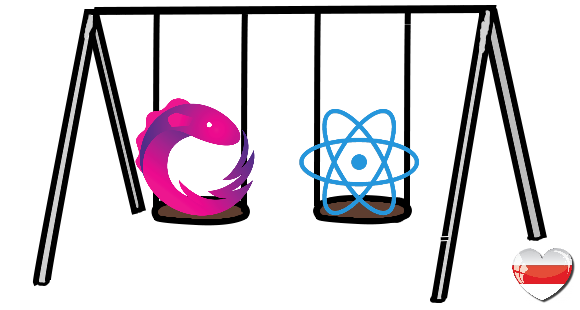

# React stack playground

> [ We can’t be silent! #SavePandaDoc](https://savebelarusit.org/en/)

 

## Goals

-   build production ready SPA stater kit(with more strong and quality oriented defaults with compared to CRA)
-   not to lose the readability of architecture and clean code
-   deep dive into React ecosystem

## Current status

Teh Project is at an early stage. It is actively developing...

### Achieved goals

-   project fully automated (CI with build/unit/e2e/test/analyzing code coverage and code quality)

### Next step

Current focus - app architecture. 
I have a clear understanding of how the app should be designed  
and i am now implementing this ideas

## TODO list

### Key technologies

-   [x] TypeScript
-   [x] UI library: React
-   [x] bundler: Webpack
-   [x] Sass + PostCSS(autoprefixer and friends)

### Quality

-   [x] CI: base on [github actions](https://github.com/rodmax/react-playground/actions)
-   [x] [CI: code coverage](https://codecov.io/gh/rodmax/react-playground)
-   [x] [CI: sonar cloud analyzer](https://sonarcloud.io/dashboard?id=rodmax_react-playground)
-   [x] E2E testing: [testcafe](https://devexpress.github.io/testcafe/)
    -   [ ] snapshots of failed tests as artifacts
-   [x] unit & international testing:
    -   [x] [jest](https://jestjs.io/)
    -   [x] [testing-library](https://testing-library.com/)
        -   [ ] attempt to find approach to reuse testing code like angular harnesses do
-   [x] Hyper strong TypeScript config
-   [x] EsLint
    -   [ ] review all set of existing rules and involve them
    -   [ ] add HOOKS related eslint rules
    -   [ ] add REACT related eslint rules
-   [x] Stylelint
-   [ ] integrate audit(LightHouse or other) to CI
-   [ ] Review tools of [minimizing for production](https://webpack.js.org/plugins/mini-css-extract-plugin/#minimizing-for-production)
-   [ ] Investigate & involve(if appreciable) dependency visualization tool, [like this](https://arkit.pro/svg/UDfDp34EW20C0C2zh-YeWrym37waaQe4sf82-dqTdI-vq3fv7r80MavQoKbGJ6s_t8In--2Vj8kYFKbFFAWq1jZuvcAL7PSL9_AS-WmGMEDtlbU28LS0)

### Build/Deploy

-   [x] add [tslib](https://www.npmjs.com/package/tslib)
-   [ ] CI: deploy to github pages via github actions

### App/Architecture

-   [x] Follow [redux architecture StyleGuide](https://redux.js.org/style-guide/style-guide) rules whenever it is reasonably possible
-   [ ] localization
-   [ ] form handling(ui/server validation, form state)
-   [ ] folder structure: description and rules
-   Store
    -   [x] Redux (fully type safe at first and with reduced boilerplate at second)
    -   [ ] try [immer](https://immerjs.github.io/immer/docs/introduction) (looks nice and recommended by redux team)
-   [x] Effects/async flow: RxJs(rxjs/observable)
-   [x] Router: router5
-   [ ] auth logic (route guards/permissions for individual features)
-   API client
    -   [x] Proof of concent using RxJs builtin clients(fetch/xhr)
    -   [ ] API client factory(rxjs based)
        -   [ ] File uploading
        -   [ ] Catch unhandled API errors on App level
-   React related:
    -   [x] [React.StrictMode](https://reactjs.org/docs/strict-mode.html)
    -   [ ] try suspense

### Development experience

-   [x] Prettier for formatting(integration with VSCode)
    -   [x] Apply prettier to all files(md,js,json,yaml)
-   [ ] Setup solution tsconfig.json (split base/app/spec/testcafe tsconfigs)
-   [ ] HMR for CSS
-   [ ] commit format & commit-based changelog generation

### Web technologies:

-   [ ] Web workers
-   [ ] WebAssembly
-   [ ] Service Worker
-   [ ] SSR
