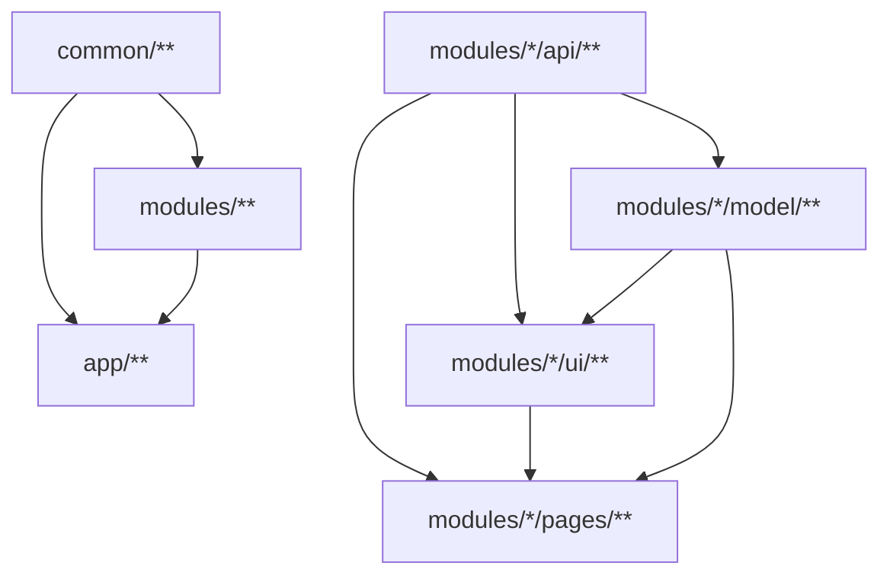

# Architecture

## Sources tree

Let't consider the following application, which has tree pages:

-   login page
-   todos page. Each todo assigned to certain user, if current user is admin he can see all todos, else only own
-   user details page. From todos page user can open assignee user details page

Further description of architectural principles will be based on this example<br>
That's how the project structure will be look like

```bash
├── app
│   └── app.tsx
├── common
│   ├── http-client
│   │   └── http-client.tsx
│   ├── testing
│   │   └── jest-utils.ts
│   └── ui
│       └── checkbox
│           └── checkbox.tsx
└── modules
    ├── auth
    │   ├── model
    │   │   └── permission.ts
    │   ├── pages
    │   │   └── login-page
    │   │       └── login-page.tsx
    │   └── state
    │       ├── auth-actions.ts
    │       └── auth-reducer.ts
    ├── todo
    │   ├── api
    │   │   ├── todo-api-client.ts
    │   │   └── todo-api.typings.ts
    │   ├── model
    │   │   └── todo-model.ts
    │   ├── pages
    │   │   └── todos-page
    │   │       ├── state
    │   │       │   ├── todos-page-actions.ts
    │   │       │   ├── todos-page-epics.ts
    │   │       │   └── todos-page-reducer.ts
    │   │       └── todos-page.tsx
    │   └── ui
    │       └── todo-card
    │           └── todo-card.tsx
    └── user
        ├── api
        │   ├── user-api-client.ts
        │   └── user-api.typings.ts
        ├── pages
        │   └── user-details-page
        │       └── user-details.tsx
        └── ui
            └── user-avatar
                └── user-avatar.tsx
```

## Dependency layers



## Rules

### No.1

Code from down layer must not use(import) code from up layer
