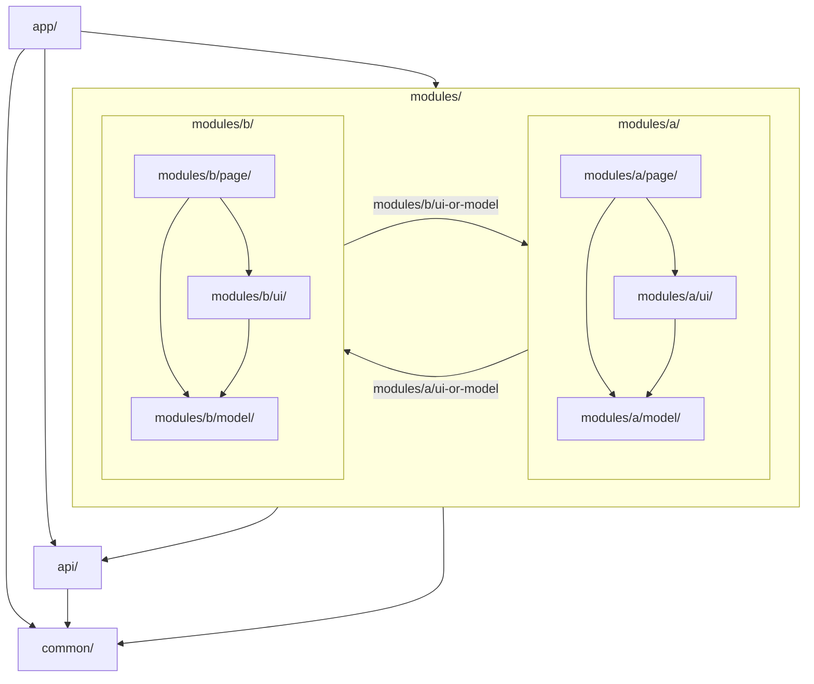
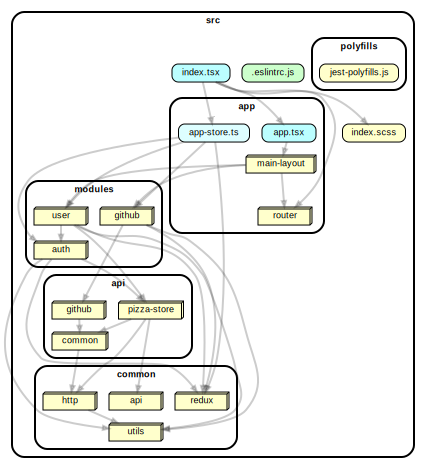

# Architecture

Here we give a set of architectural principles and rules that the application follows

## LIFT

Do structure the app such that you can

-   **Locate** code quickly,
-   **Identify** the code at a glance,
-   keep the **Flattest** structure you can,
-   and **Try** to be DRY. [taken from here](https://angular.io/guide/styleguide#lift)

## Overall structure guidelines

### Folders-by-feature structure

Create folders named for the feature area they represent.

```bash
# BAD
reducers/
   user-page.reducer.ts
actions/
   user-page.actions.ts
epics/
   user-page.epics.ts
pages/
    user-pages/
        user-page{spec.tsx,.tsx,.scss}

# GOOD
user/
    pages/
        user-page/
            user-page{spec.tsx,.tsx,.scss}
        state/
            user-page.{reducer,actions,epics}.ts
```

## Dependency layers

Below is a diagram showing the dependency rules in the application<br>
[dependency-cruiser](https://github.com/sverweij/dependency-cruiser) utility used to control this dependencies<br>
(See [depcruise/](../depcruise) configs for details)



and below is how it looks in real code



## Layers

-   [app layer](layer-0-app.md)
-   [modules layer](layer-1-modules.md)
-   [api layer](layer-2-api.md)
-   [common layer](layer-3-common.md)
-   third-party libs layer
