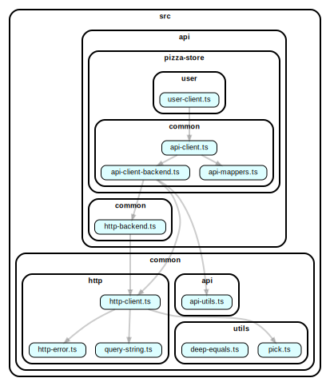

# API layer

> Overall architecture described [here](architecture.md)

API layer code

-   implements clients through which the [modules](layer-1-modules.md) layer load/send data from/to the backend server(s)
-   lives in `src/api`
-   DEPENDS only from [common](layer-3-common.md) layer
-   NOT DEPENDS from [app](layer-0-app.md), [modules](layer-1-modules.md) layers

## API sub-layers

### Resource client

The sub-layer provides a set of request to specific resource.
 For example `src/api/pizza-store/user/user-client.ts` provides methods for requests like: `GET /api/v1/users, POST /api/v1/users, DELETE /api/v1/users, etc`

### API common

Common code which reused by many resource specific clients:

-   ApiClient with set of `.get(),post(),.delete()` method suitable for any resource client
-   API types for pagination, ListDto, etc

### HTTP common(`common/http`)

Provides utilities to work with http protocol

### Example graph for user client

> NOTE: in our reference application we use several backend services 
> One of which the `pizza-store` service, so all related it code lives in `api/pizza-store` sub-folder. 
> If you work with one backend entry point in your app, you should put user client code directly to `api/user/user-client.ts`

